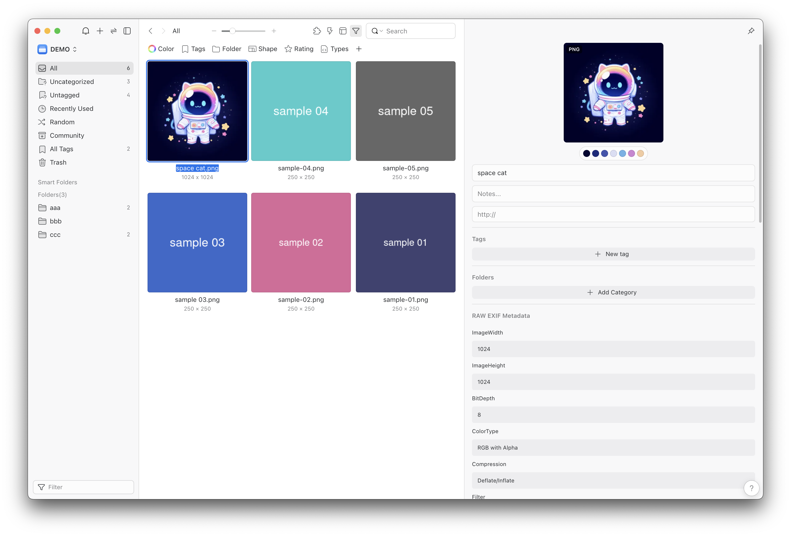

# [Eagle] RAW EXIF Metadata

[](https://github.com/tuki0918/eagle-raw-exif-inspector/releases/tag/v2.2.3)
[](https://community-en.eagle.cool/plugin/1152a2b2-499f-4d4e-afd2-2554fe44808a)
[](https://community-en.eagle.cool/plugin/1152a2b2-499f-4d4e-afd2-2554fe44808a)




[Eagle](https://eagle.sjv.io/RGANON)

## Features

A quick EXIF viewer plugin for PNG, JPEG, and WebP images with the following features:

- **⭐ Favorites**: Bookmark your most important EXIF fields for quick access
- **👁️ Show/Hide Fields**: Control which EXIF data to display, hiding unnecessary information
- **📋 JSON Formatting**: Convert EXIF data to clean, readable JSON format

<details>
<summary>Also supports images from:</summary>

- `ComfyUI Workflows`
- `Stable Diffusion`
- `NovelAI`
- `Midjourney`
- `Nijijourney`
- `C2PA` (planned)

</details>

## Installation

Eagle Community: [Plugin page](https://community-en.eagle.cool/plugin/1152a2b2-499f-4d4e-afd2-2554fe44808a)

or, Manual Installation: [Github Releases page](https://github.com/tuki0918/eagle-raw-exif-inspector/releases)

## Usage

```
$ npm ci
$ npm run build
```

- Import the `dist` folder as a plugin in Eagle App.

## Contributing

Contributions are welcome! Feel free to open issues or submit pull requests to improve the plugin.
