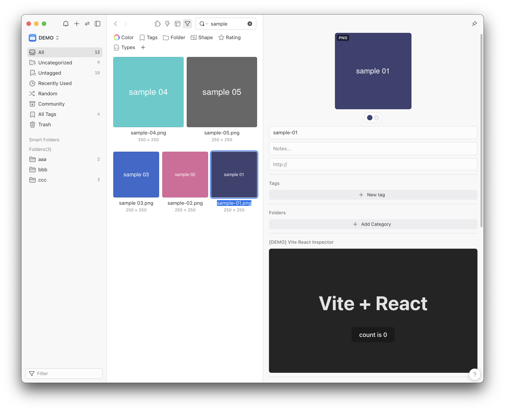

# [DEMO] Vite React Inspector



## Usage

```
$ npm ci
$ npm run build
```

- Import the `dist` folder as a plugin in Eagle App.

## Note

> [Getting Started - Your First Plugin](https://developer.eagle.cool/plugin-api/get-started/creating-your-first-plugin)
